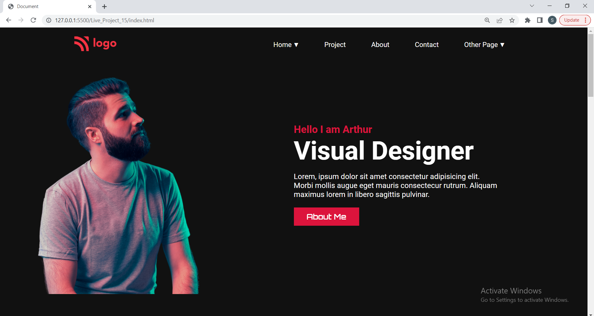
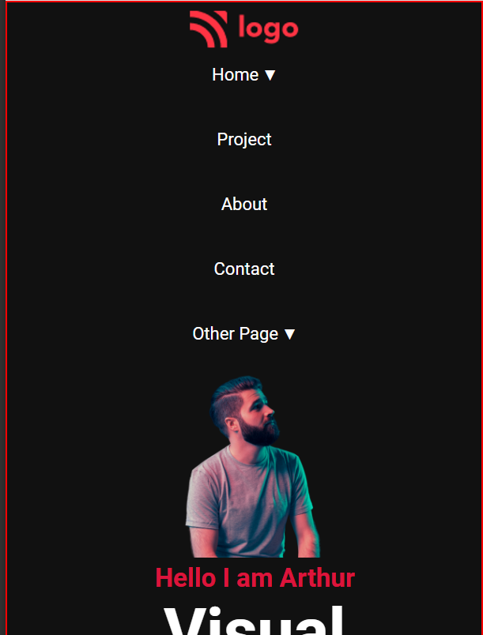

# Visual Designer [](http://www.gnu.org/licenses/agpl-3.0)

Visual-Designer-Portfolio Template Project Template Project
This is basically a fully blown website project made in HTML/CSS with 4 to 5 web pages for an imaginary visual designer on the internet.

Hope you like my project !! it works good in laptop screen and mobile.

## Technologies Used
  - HTML
  - CSS
  - CSS Flex Box

## Demo
### Laptop View


### Mobile Screen View


## Run Locally

Clone the project

```bash
  git clone https://github.com/suhas-sm/Visual-Designer.git
```

Go to the project directory

```bash
  cd Visual-Designer
```

## Features

- Transition Scroll Effect
- Modern Typical webpage design
- UI/UX Design
- Full Blown Website
- Mobile Responsive
- Amazing card design

## What i have learnt By working on this project
1. I have improved my self in positioning of images in a spesific position, also using flex properties
2. Improved in designing the project
3. Making it responsivness in better way
4. Got a good understanding on createing big one pager website
5. Enhanced my cretivity on web development

## Honest Time to finish the project

I had took about 3 hours. This project made me understand how to make an image positioned with respect to other and also using flex properties.

## Feedback

If you have any feedback, please reach out to us at melmurissm11@gmail.com
